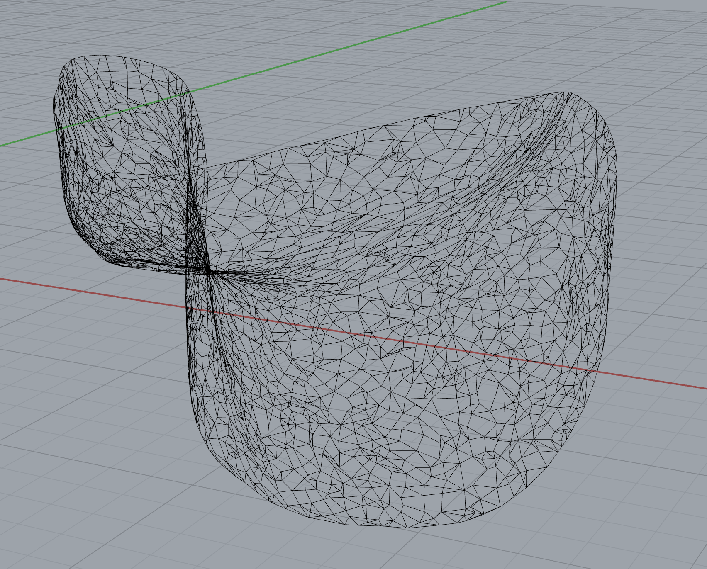
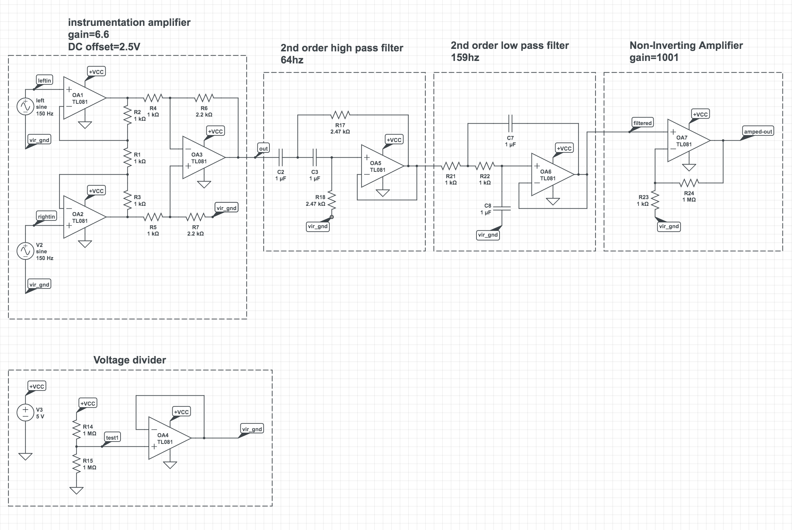

# OpenBCI data prediction stream

We are using OpenBCI Ganglion to collect data with its GUI networking widget and uses OSC to stream data, capturing EMG signals from the vocal cords and translating it to words and sentences.

We modeled and 3D printed a neckpiece to locate the placement of electrodes. 

Version 1 rig for data collection, where we used a audio interface and 

[Video](https://www.youtube.com/watch?v=sHNEoIGQpKE) introduction about the project setup, data collection proecess, and demo use. 

- Uses the python-osc library to communicate with the OpenBCI device.
- This version is using synchronous streaming, which is not the most optimal way to stream data, but what I want to do is to get it to work first without losing any data from the device.

- While using the python-osc library, had a problem where I was getting duplicate data from the device, and after I restart the OpenBCI GUI, the data would stream properly, so reminder is to restart the GUI whenever you want to stream or record data.

## Software
- Autodesk Recap: [Recap](https://www.autodesk.com/products/recap/features) Using images to create 3D models. We had a person sit in a chair and circled around the person taking around 50 photos and stitching them together in Recap.

## Hardware
- Bio Sensing Tool for EMG/EEG used: [OpenBCI Ganglion](http://docs.openbci.com/Tutorials/02-Ganglion_Getting%20Started_Guide)
- Electrodes: [3M surface electrodes]( https://www.amazon.com/Red-Dot-Multi-Purpose-Monitoring-Electrode/dp/B01AME7YC0/ref=sxts_sxwds-bia?keywords=3m+electrodes&pd_rd_i=B01AME7YC0&pd_rd_r=ac7163a4-9ddb-48be-bcf7-5ddab0b5c801&pd_rd_w=THwiB&pd_rd_wg=rq0Jg&pf_rd_p=1cb3f32a-ccfd-479b-8a13-b22f56c942c6&pf_rd_r=Y72D06NDW0E7GSNPT1EC&psc=1&qid=1575842343)
- Simple self-made EMG sensing circuit using op-amps. 
[Video](https://photos.google.com/search/_tv_videos/photo/AF1QipM1aNfcQVgCFBbHl27yeNj9VXmZbmjKsnpCxzvA) example of said circuit in action, sensing EMG activity on the oscilloscope.

## setup for data collection
- Make sure to use python 3.6 and above
- Install required modules:
    - `pip install -r requirements.txt`
- Create required directories:
    - `python setup.py`

#### `osc_stream.py`
- Reads in the OpenBCI from the OSC server, takes 20 data points and converts them to csv files continuously up to 30 files,
and then rewrites them.

#### Additional parameters
- `--option` 
  - `print` : prints the data streaming from the device. Mainly used for checking the connection between the GUI and OSC.
  - `predict` : records a fixed interval and runs the data through a pre-trained model and predicts what the data corresponds to. (ex: 'yes' or 'no')

#### `osc_collect_data.py`
- This scripts works by outputting the label it is currently recording onto the terminal, and records for a fixed duration.
- Once the user sees the output on the terminal, he/she should make the gesture according to the label.

#### Additional parameters
- `--option`
    - `fname` : default output directory will be the current time, if you want to change it you can name it with this option.
